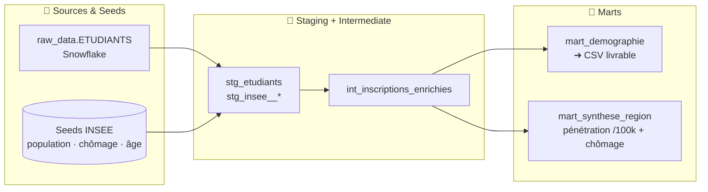

# P8 — Analyse sociodémographique des étudiants Data avec DBT

[](https://www.getdbt.com/)
[](https://www.snowflake.com/)
[](https://www.python.org)
[](#)

> Pipeline **DBT** (architecture médaillon Bronze → Silver → Gold) analysant l'évolution du profil sociodémographique des étudiants du parcours Data d'OpenClassrooms (2022-2025), fiabilisé, conforme au RGPD et **enrichi de trois référentiels INSEE**.

---

## 🎯 Contexte & besoin métier

La direction pédagogique souhaite **objectiver** l'évolution du profil (âge, genre, région) des étudiants Data sur quatre ans, au-delà des impressions, pour éclairer ses décisions d'**accessibilité et d'égalité des chances**. Le fil directeur de l'analyse : **comparer systématiquement le profil OC à la population française (INSEE)**, afin de distinguer ce qui est propre à OC de ce qui reflète simplement le secteur du numérique.

---

## 📦 Livrables

| Livrable | Fichier | Contenu |
|---|---|---|
| **Pipeline DBT** | `pipeline/` (dézippé) | Projet dbt complet : modèles, seeds INSEE, macro, tests, doc |
| **Données consolidées** | `DERVOUT_Corentin_2_données_082026.csv` | Export du mart final (agrégats OC × INSEE) |
| **Présentation** | `DERVOUT_Corentin_1_presentation_082026.pptx` | Support de soutenance (méthode, résultats, recommandations) |

---

## 🗂️ Données & sources

- **OpenClassrooms** (Snowflake, couche brute) : inscriptions au parcours Data — **4 647 inscriptions** pour **4 010 étudiants distincts** (14 % se réinscrivent sur plusieurs années).
- **INSEE** — trois **référentiels versionnés dans le repo sous forme de *seeds*** (reproductibilité sans dépendance externe) : population régionale 2023, **taux de chômage régional** 2024/2025, structure d'âge nationale.

---

## 🏗️ Architecture du pipeline



**~34 tests automatisés · 1 macro d'harmonisation des régions · 100 % reproductible (`dbt seed` + `dbt run`)**

Staging et intermediate matérialisés en **vues**, marts en **tables**. La macro `harmoniser_region` (trim des libellés) est réutilisée partout pour fiabiliser les jointures OC ↔ INSEE.

---

## ✅ Qualité des données & choix documentés

Tests à chaque couche : `not_null`, `unique`, `accepted_values` (genres, années, tranches d'âge), **`relationships`** (chaque région OC doit exister dans le référentiel INSEE), `unique_combination_of_columns`, `accepted_range`, et surtout un **test de réconciliation singulier** qui vérifie que **Σ des inscriptions du mart = nombre de lignes du staging (4 647)** — garantie qu'aucune ligne n'est perdue ni dupliquée par l'agrégation.

Choix méthodologiques assumés et commentés dans le code :
- **Genre manquant → « Non renseigné »** (ligne conservée) : le NR est une information en soi (~27 % des lignes, en forte décroissance) ; le supprimer biaiserait les volumes ;
- **Aucune déduplication** : le grain est l'**inscription**, et les réinscriptions (14 %) sont des événements réels ;
- harmonisation systématique des régions via la macro.

---

## 📊 Résultats & lecture

| Analyse | Résultat clé |
|---|---|
| **Volume** | 2022 : 1 696 → 2024 : 850 (**‑50 %**) → 2025 : 951 (**+12 %**, rebond partiel) |
| **Genre (piège du NR)** | Brut : F 18 % → 31 %… mais **hors NR, la part des femmes est stable (~30-33 %, +2,3 pts)** |
| **Âge** | Rajeunissement réel : 20-24 ans **+7,3 pts**, 25-29 ans +6,5 pts ; les 40+ reculent |
| **Géographie** | IDF = **45,6 %** des inscrits ; pénétration **17,1 inscrits/100k en IDF vs ~4,5 ailleurs** |
| **Chômage** | Corrélation chômage régional × inscrits/100k **r ≈ 0,04** → **quasi nulle** |
| **Comparaison INSEE** | OC ~69 % d'hommes (hors NR) vs 51 % de femmes en France, mais ~29 % dans les métiers du numérique |

**Le point d'analyse le plus fin — le « piège du non-renseigné ».** Lue naïvement, la donnée brute suggère une forte féminisation (part des femmes de 18 % à 31 %). Mais sur la même période, la part de « Non renseigné » **s'effondre de 42 % à 7 %** : on a surtout *mieux collecté* le genre. En isolant les genres réellement déclarés, la part des femmes est **stable (~30-33 %)**. La féminisation apparente est donc un **artefact de collecte** — exactement la nuance qui change une recommandation. À l'inverse, le **rajeunissement** est robuste (indépendant du genre), et l'analyse **inscrits/100k croisée au chômage** montre que les inscriptions suivent des **facteurs urbains et l'écosystème tech**, pas le chômage régional.

**Profil type déclaré** : un **homme, 30-34 ans, francilien, en reconversion de milieu de carrière**. L'enrichissement INSEE recadre l'ensemble : le déséquilibre de genre reflète le **secteur du numérique**, pas une spécificité d'OC.

---

## 🔒 Conformité RGPD

Minimisation (seules les variables utiles conservées) · pseudonymisation (`USER_ID` technique, aucun nom/e-mail) · **tables finales strictement agrégées** (aucune ligne individuelle) · vigilance sur les petits effectifs (DROM) pour éviter la ré-identification.

---

## ⚠️ Limites & prochaines pistes

- Le **non-renseigné (~27 %)** est très inégal dans le temps → les analyses de genre sont conduites **hors NR** ;
- la **région est déclarée à l'inscription**, pas nécessairement la région de résidence ;
- le grain étant l'inscription, les **14 % de réinscrits** comptent plusieurs fois (choix assumé, documenté).

---

## 🧰 Compétences & outils

`dbt` · `Snowflake` · `Python` — Modélisation en couches (médaillon), seeds versionnés, macros, matérialisations · Tests de qualité (relationships, accepted_values, réconciliation) · Enrichissement multi-sources et indicateurs dérivés (pénétration /100k, corrélation) · Lecture critique des données (artefact de collecte) · Gouvernance & RGPD · Restitution et recommandations.

---

## 📁 Structure du dossier

```
P8 - Analyse sociodémographique (DBT)/
├── DERVOUT_Corentin_1_presentation_082026.pptx     # support de soutenance
├── DERVOUT_Corentin_2_données_082026.csv           # export du mart final
└── pipeline/                                        # projet dbt dézippé
    ├── models/
    │   ├── staging/       # stg_etudiants + stg_insee__{population,chomage,structure_age}
    │   ├── intermediate/  # int_inscriptions_enrichies
    │   └── marts/         # mart_demographie (CSV) · mart_synthese_region (/100k)
    ├── seeds/             # référentiels INSEE versionnés
    ├── macros/            # harmoniser_region
    ├── tests/             # assert_reconciliation_inscriptions
    └── dbt_project.yml · packages.yml
```

---

*Projet réalisé dans le cadre du parcours Data Analyst d'OpenClassrooms (titre RNCP niveau 6). Données OC pseudonymisées et agrégées ; référentiels INSEE en open data.*
