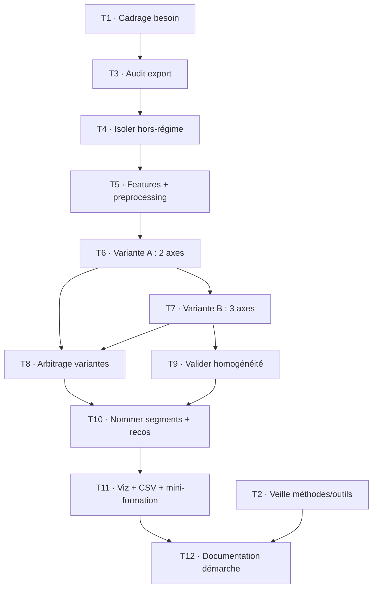
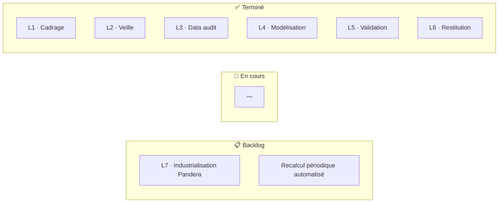
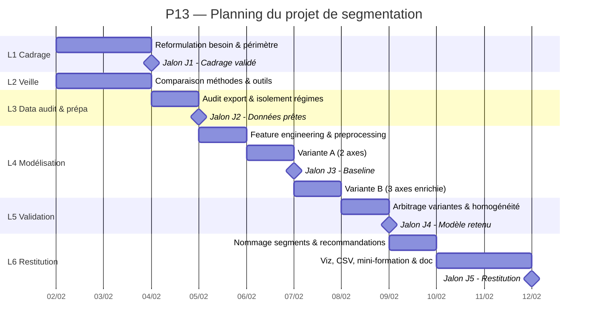

# P13 — Documentation de la démarche
### Amélioration du livrable P6 par une approche de Machine Learning non supervisé

> **Projet** : Segmentation automatisée du catalogue BottleNeck par clustering
> **Livrable d'origine** : Notebook P6 — Analyse du stock et des ventes
> **Source de travail** : `df_merge_bottleneck.xlsx` (export consolidé et nettoyé du P6)

---

## 1. Cahier des charges fonctionnel

### 1.1 Contexte et parties prenantes

Le projet P6 a produit une analyse exploratoire **descriptive** du catalogue de BottleNeck
(caviste en ligne) : nettoyage et fusion des sources ERP / web / liaison, puis analyse **univariée**
du prix, du chiffre d'affaires, des quantités vendues, du stock et de la marge.

| Partie prenante | Utilise l'analyse pour décider… |
|---|---|
| Direction commerciale (Nicolas, CODIR) | Orientation de l'assortiment, priorités de gestion |
| Gestion des stocks | Quels produits réapprovisionner, quels stocks liquider |
| Marketing / e-commerce | Quels produits mettre en avant sur le site |

Cette analyse variable par variable répond à un besoin de **constat**, pas de **décision** : elle ne
dit pas *comment regrouper les produits* pour piloter le catalogue.

### 1.2 Problématique métier reformulée

> *« Tous les produits du catalogue ne se valent pas. Peut-on les regrouper automatiquement en
> familles cohérentes — selon leur positionnement prix, leur volume de ventes et leur rotation de
> stock — afin d'orienter les décisions d'assortiment, de pricing et de gestion de stock ? »*

L'approche consiste à révéler des **familles de comportements**, chacune appelant une stratégie
différenciée (sécuriser, piloter par le stock, déstocker). La segmentation est **multivariée et
data-driven** : ce n'est pas l'analyste qui fixe les segments a priori, c'est l'algorithme qui les
révèle, l'analyste se chargeant de les interpréter et de les nommer.

### 1.3 Périmètre

| Traité | Non traité |
|---|---|
| Segmentation du **cœur de catalogue actif** (produits vendus au moins une fois) | Prévision de ventes dans le temps (pas d'historique daté dans l'export) |
| Variables : prix, ventes cumulées, rotation de stock | Ancienneté de la fiche (**colonne `post_date` absente de l'export**) |
| Isolement des produits « hors régime » (invendus, hors-web) par règle métier | Données externes (concurrence, saisonnalité, météo) |
| Restitution métier + export exploitable (CSV) | Recommandation produit / personnalisation client |

### 1.4 Contraintes

- **Données** : snapshot d'octobre, pas de série temporelle → **forecasting exclu d'emblée** ; et
  pas de date de mise en ligne → **pas d'axe ancienneté** (différence notable avec d'autres exports
  du même projet).
- **Volumétrie** : 689 produits dans le cœur de catalogue → faible volume, modèle à interpréter avec
  prudence (POC, non déployable en l'état).
- **Qualité** : anomalies de saisie identifiées en P6 (marges négatives, prix incohérents).
- **Reproductibilité** : résultats stables d'une exécution à l'autre (graine fixée, pas de dépendance
  à la date courante).
- **Outillage imposé / maîtrisé** : Python / pandas / scikit-learn ; formats de travail **Excel et
  CSV** exclusivement (pas de format binaire opaque type pickle/parquet côté livrable).

### 1.5 Critères de réussite (critères d'acceptation)

| Niveau | Critère | Cible | Statut |
|---|---|---|---|
| **Data** | Aucune valeur manquante / infinie sur les variables de clustering | 0 NaN, 0 inf | ✅ garde-fou `assert` |
| **Data** | Anomalies métier isolées avant modélisation | Invendus + hors-web sortis du scope | ✅ 111 + 25 isolés |
| **Modèle** | Nombre de segments justifié par une métrique objective | Silhouette + coude convergents | ✅ k=3 |
| **Modèle** | Robustesse testée par comparaison | ≥ 2 algos ET ≥ 2 jeux de variables | ✅ KMeans/Ward, variantes A/B |
| **Opérationnel** | Résultat reproductible | `random_state` fixé, source Excel | ✅ |
| **Métier** | Segments interprétables et actionnables | Chaque segment nommé + 1 reco | ✅ 3 segments |

---

## 2. Veille métier et technologique

### 2.1 Besoin de veille

Passer d'une **analyse univariée manuelle** (P6) à une **segmentation multivariée automatisée**
suppose de choisir : (a) une méthode de regroupement, (b) une méthode de choix du nombre de groupes,
et (c) d'envisager un outil de fiabilisation de la donnée en amont pour une future industrialisation.
La veille porte donc sur ces trois axes.

### 2.2 Panel de solutions évaluées

| Axe | Solution | Cas d'usage | Avantages | Limites | Décision |
|---|---|---|---|---|---|
| **Méthode de clustering** | **KMeans** | Partitionnement de données numériques sur géométrie « plate » | Rapide, simple, bien documenté, centroïdes interprétables | Suppose des clusters sphériques de taille proche ; sensible à l'échelle et aux outliers | **Retenu** (meilleure silhouette à tous les k) |
| | Clustering hiérarchique (Agglomératif / Ward) | Données sans k connu a priori, lecture par dendrogramme | Pas besoin de fixer k au départ, structure hiérarchique lisible | Plus coûteux, silhouette inférieure ici | **Comparé** (témoin de robustesse, accord ARI 0,79) |
| | DBSCAN | Clusters de forme arbitraire, détection de bruit | Trouve k automatiquement, robuste au bruit | Paramétrage `eps` délicat, mauvais sur densités variables et faible volume | **Écarté** (paramétrage non adapté au volume) |
| **Choix du nombre de clusters** | Score de silhouette + méthode du coude | Validation interne de la partition | Critères objectifs et chiffrés, croisables | Silhouettes modestes sur données en continuum | **Retenu** (les deux convergent sur k=3) |
| **Qualité de données (amont)** | **Pandera** | Validation de DataFrame en notebook / pipeline ML | Léger, API proche de pandas, type-safe façon Pydantic, validation statistique intégrée | Centré pandas/Polars, pas de reporting « métier » natif | **Piste retenue** pour industrialisation future |
| | Great Expectations | Qualité de données en pipeline de production | Multi-moteur (pandas/Spark/SQL), Data Docs lisibles par le métier, gouvernance | Lourd (100+ dépendances), surdimensionné pour un notebook | **Écarté** à ce stade (sur-ingénierie) |

### 2.3 Critères de comparaison

Qualité du résultat (séparation des groupes), robustesse / biais, coût en temps de calcul,
reproductibilité, interprétabilité, et maintenabilité / poids de l'outil.

### 2.4 Sources

- scikit-learn — *2.3. Clustering* (documentation officielle, comparatif des algorithmes) :
  https://scikit-learn.org/stable/modules/clustering.html
- scikit-learn — *Selecting the number of clusters with silhouette analysis* :
  https://scikit-learn.org/stable/auto_examples/cluster/plot_kmeans_silhouette_analysis.html
- Pandera — documentation officielle : https://pandera.readthedocs.io/
- endjin — *Data validation in Python: a look into Pandera and Great Expectations* :
  https://endjin.com/blog/a-look-into-pandera-and-great-expectations-for-data-validation

---

## 3. Démarche : hypothèses, tests, résultats, décisions

> Cette section trace les choix de modélisation, leurs justifications, et les pistes écartées.
> C'est le cœur de la démarche critique : chaque décision est argumentée et, le cas échéant,
> documentée *même quand elle conduit à écarter une option*. La démarche repose sur la **comparaison
> de deux variantes de segmentation** (jeu de variables restreint vs enrichi), arbitrées sur des
> critères explicites.

### 3.1 Préparation : isoler les régimes particuliers avant le ML

**Hypothèse** : tous les produits ne relèvent pas du même *régime*. Un produit jamais vendu, ou
absent du site, n'est pas « un produit qui vend peu » : c'est un **état qualitatif distinct**.

**Décision** : isoler ces cas par **règle métier explicite** *avant* le clustering, plutôt que de
demander à l'algorithme de les deviner.

| Règle | Volume |
|---|---|
| Hors site web (`total_sales` manquant, absent de l'export web) | 111 produits |
| Invendus (`total_sales == 0`) | 25 produits |
| → **Cœur de catalogue** (base du clustering) | **689 produits** |
| *Contrôle* | 111 + 25 + 689 = **825** ✅ |

**Décision documentée** : les **4 marges négatives** repérées en P6 ont été localisées — elles sont
**toutes déjà isolées** (1 invendu + 3 hors-web). Aucune n'appartient au cœur de catalogue : créer
une règle supplémentaire serait redondant. Elles sont signalées pour correction ERP (chantier P6),
sans impact sur la modélisation.

### 3.2 Choix des variables (features)

**Anti-fuite de données (data leakage)** — variable explicitement **exclue** des features :
- `ca` (= `total_sales × price`) : colinéaire aux entrées, simple changement d'échelle. L'inclure
  ferait fuiter l'information des axes prix et ventes. Elle est **conservée en lecture seule** pour
  chiffrer le poids des segments a posteriori.

**Marge écartée des axes** : `taux_marge` est quasi-plate — 75 % des produits entre **56,6 % et
66,3 %** (médiane 61,3 %). Une variable non discriminante n'aide pas à séparer des groupes et n'ajoute
que du bruit. Elle est **conservée en lecture seule** pour qualifier les segments a posteriori.

**Variables retenues** : `price` (positionnement), `total_sales` (volume), `stock_mois`
(= `stock_quantity / total_sales`, rotation).

### 3.3 Pré-traitement (justifié par la forme des distributions)

Le notebook visualise les distributions avant de décider. Deux opérations distinctes :

| Opération | Appliquée à | Pourquoi |
|---|---|---|
| `log1p` | `price` (asym. 2,6), `total_sales` (asym. 0,9), `stock_mois` (asym. 4,9) | Corriger l'**asymétrie à droite** (longue traîne qui écraserait les distances euclidiennes de KMeans) |
| `StandardScaler` | tous les axes | KMeans raisonne en **distances** : sans mise à l'échelle commune, une variable aux grands nombres écraserait les autres |

### 3.4 Comparaison de deux variantes de segmentation

C'est le cœur de la démarche comparative : **deux jeux de variables**, mêmes algorithmes, mêmes
métriques, puis arbitrage.

| | **Variante A — 2 axes** | **Variante B — 3 axes (enrichie)** |
|---|---|---|
| Variables | prix, ventes | prix, ventes, **rotation de stock** |
| Périmètre | 689 produits | 689 produits |
| Meilleure silhouette KMeans | 0,408 (k=3) | **0,481 (k=3)** |
| Coude de l'inertie | k=3 | k=3 (chute 1232 → 796) |
| Accord KMeans/hiérarchique (ARI) | — | 0,788 |
| Ce qu'elle révèle | 3 paliers de prix | **isole le stock dormant** |

**Choix du nombre de clusters** : pour la variante B, silhouette (max à k=3) et coude de l'inertie
**convergent sur k=3**. KMeans domine le clustering hiérarchique sur la silhouette à toutes les
valeurs de k → **KMeans retenu**, hiérarchique conservé comme témoin de robustesse (accord ARI 0,79
à k=3 : les deux algorithmes voient la même structure).

### 3.5 Arbitrage multi-critères

| Critère | Favorise | Commentaire |
|---|---|---|
| **Netteté statistique** (silhouette) | **Variante B** | 0,481 > 0,408 : l'enrichissement sépare mieux |
| **Robustesse** (ARI) | Variante B | 0,79 : structure confirmée par deux algorithmes |
| **Parcimonie** | Variante A | Moins d'axes = modèle plus simple |
| **Valeur métier** | **Variante B** | Révèle un segment *invisible* dans A : 32 produits à stock dormant |

**Décision finale : variante B (3 axes, k=3).** Cas favorable : l'enrichissement **ne coûte rien**.
La variante B est *à la fois* plus nette statistiquement *et* plus actionnable. Le seul avantage de A
(parcimonie) ne pèse pas face à un segment décisionnel entier qu'elle masquait. *L'ajout de la
rotation de stock est l'apport central de la démarche.*

### 3.6 Résultats — trois segments métier (+ un groupe isolé)

| Segment | Volume | Profil (médianes) | Part du CA | Lecture métier |
|---|---|---|---|---|
| **Moteur de CA** | 413 | Prix 16 € · ventes 10 · stock 2,8 mois · marge 61 % | 48,5 % | Fond de commerce : entrée/milieu de gamme qui tourne, plus gros CA total par effet volume |
| **Premium** | 244 | Prix 46 € · ventes 5 · stock 1,6 mois · marge 61 % | 43,2 % | Haut de gamme à rotation rapide, fort panier unitaire, stock sain |
| **Stock dormant** | 32 | Prix 61 € · **stock 16,5 mois** · marge 40 % | 8,3 % | Capital immobilisé : produits chers, peu rentables, stock > 1 an |
| *Invendus (isolés)* | 25 | `total_sales = 0` | — | Stock dormant absolu, sortis par règle avant le ML |

**Validation du segment révélé** : dispersion homogène (min 6 mois de stock, Q1 à 12 mois, médiane
16,5) → segment **réel**, pas un artefact tiré par quelques outliers.

**Apport du ML vs analyse manuelle** : une segmentation intuitive sur le seul couple prix/ventes
(variante A) retrouve les segments évidents mais **masque le stock dormant**. C'est l'ajout de la
**rotation de stock** qui fait émerger ces 32 produits chers à faible marge, dilués dans les paliers
de prix. Le ML apporte une **frontière reproductible, multivariée et scalable**, là où l'analyse
manuelle reste subjective et limitée à deux ou trois axes.

### 3.7 Limites & biais

- **Silhouette modeste** (~0,48) : le catalogue est davantage un *continuum* qu'un ensemble de paquets
  nettement isolés. Segments **statistiquement modestes mais métier-pertinents** — assumé.
- **Faible volume** (689 produits) : segmentation exploratoire, à reconsolider sur un historique plus large.
- **Snapshot** : pas de dimension temporelle des ventes → pas de dynamique/tendance, pas d'axe ancienneté.
- **Choix de k et du jeu de variables** : part de subjectivité, encadrée par les métriques (silhouette,
  coude, ARI) et l'arbitrage documenté.

### 3.8 Reproductibilité

- `random_state = 42` et `n_init = 10` sur KMeans.
- Aucune dépendance à la date d'exécution.
- Données de travail chargées depuis l'**export Excel** du P6 (format maîtrisé, lisible) ; catalogue
  segmenté ré-exporté en **CSV** (`utf-8-sig`, directement ouvrable dans Excel).
- Notebook séparé du P6 : le P6 reste le notebook de nettoyage, le P13 repart de l'export consolidé.
- Garde-fou `assert` contre les `NaN`/`inf` avant chaque clustering.

### 3.9 Usage de l'IA dans la démarche

Un assistant IA conversationnel a été mobilisé comme **outil de travail critique**, et non comme
source de réponses à appliquer telles quelles. Son usage a porté sur trois plans : le **brainstorming
d'axes** (comparaison des approches détection d'anomalies / régression / clustering avant arbitrage),
l'**aide au code** (pipeline scikit-learn, syntaxe pandas) et la **relecture méthodologique**
(détection de pièges : data leakage sur `ca`, choix des transformations selon la forme des
distributions).

Chaque suggestion a été **soumise à validation** plutôt qu'acceptée par défaut. Plusieurs propositions
ont été explicitement **écartées ou redressées** : abandon d'une piste d'ancienneté (colonne absente
de l'export), rejet d'une variante à 4 axes intégrant la marge (dégradation mesurée de la silhouette,
0,393), exclusion de `ca` des features (data leakage). Les décisions finales — variables retenues,
exclusion de la marge, choix de *k*, arbitrage entre variantes — relèvent d'un jugement métier et
statistique **assumé par l'auteur**, l'IA servant à accélérer l'exploration et à fiabiliser, non à décider.

---

## 4. Mini-formation à destination des métiers

**Objectif** : permettre à un category manager / gestionnaire de stock de **lire et exploiter** la
segmentation sans connaissance technique.

**Format proposé** : une session courte (30 min) + une fiche d'une page + le fichier CSV segmenté.

**Messages clés à transmettre** :

1. **Ce qu'est un segment** — un groupe de produits qui se ressemblent sur trois critères (prix,
   ventes, rotation de stock). Ce n'est pas un classement « bon / mauvais », c'est une **famille de
   comportements**.
2. **Comment lire les 3 segments** — chacun appelle une action différente :
   - *Moteur de CA* → le socle à sécuriser (disponibilité) ;
   - *Premium* → à piloter par le stock, pas par le volume ;
   - *Stock dormant* → à traiter en priorité (déstockage).
3. **Ce que ça change concrètement** :
   - *Moteur de CA* → priorité absolue à la disponibilité (une rupture = perte directe de chiffre).
   - *Premium* → optimiser le niveau de stock plutôt que pousser les ventes ; rotation lente n'est pas
     un problème tant que le stock reste sain.
   - *Stock dormant* → déstockage ciblé / promo de liquidation / arrêt de réappro : du cash immobilisé
     sans contrepartie de marge.
   - *Invendus (25)* → stock dormant absolu : décision produit par produit (relancer / arrêter).
4. **Les limites à garder en tête** — segmentation indicative sur un instantané, à recalculer
   périodiquement ; le jugement métier reste décisionnaire, l'outil aide, il ne décide pas.

**Support** : la visualisation finale du notebook (rotation de stock × marge, colorée par segment,
taille = prix) sert de support visuel unique et parlant — elle montre le *Stock dormant* se détacher
du reste.

---

## 5. Organisation et pilotage du projet

> Le projet a été conduit selon un découpage en lots, un backlog priorisé et un suivi des risques.

### 5.1 Découpage en lots

| Lot | Contenu | Livrable de sortie |
|---|---|---|
| **L1 — Cadrage** | Reformulation du besoin métier, périmètre, contraintes, critères d'acceptation | Cahier des charges fonctionnel (§1) |
| **L2 — Veille** | Exploration des méthodes/outils, comparaison, choix argumentés | Tableau de veille sourcé (§2) |
| **L3 — Data audit & préparation** | Audit de l'export P6, isolement des régimes particuliers, feature engineering | Jeu `df_core` propre + features |
| **L4 — Modélisation** | Pré-traitement, comparaison des 2 variantes, choix de k, comparaison d'algos | Tables silhouette + clusters |
| **L5 — Validation** | Homogénéité des segments, contrôles anti-leakage, reproductibilité | Profils validés + garde-fous |
| **L6 — Restitution** | Nommage métier des segments, recommandations, visualisation, mini-formation, export CSV | Conclusion notebook + §4 |
| **L7 — Industrialisation légère** *(piste future)* | Validation automatisée (Pandera), recalcul périodique | *Non réalisé — backlog futur* |

### 5.2 Backlog priorisé

Estimation en charge relative : **S** (≤ ½ j), **M** (½–1 j), **L** (> 1 j).

| # | Tâche / User story | Lot | Charge | Dépend de | Definition of Done |
|---|---|---|---|---|---|
| T1 | Reformuler le besoin métier en problématique non ambiguë | L1 | S | — | Problématique validée, parties prenantes identifiées |
| T2 | Comparer méthodes de clustering + outils qualité, sourcer | L2 | M | — | Tableau de veille avec ≥ 2 options/axe + sources fiables |
| T3 | Charger et auditer l'export P6 (NaN, types, anomalies) | L3 | S | T1 | Colonnes typées, anomalies recensées |
| T4 | Isoler hors-web + invendus par règle métier | L3 | S | T3 | `df_core` = cœur de catalogue, 825 reconstitué |
| T5 | Feature engineering + pré-traitement (log/scale justifiés) | L4 | M | T4 | 0 NaN/inf dans X, transfos argumentées par distribution |
| T6 | Variante A (2 axes) : silhouette + coude + compare algos | L4 | M | T5 | k justifié, KMeans vs hiérarchique comparé |
| T7 | Variante B (3 axes) : idem, avec rotation de stock | L4 | M | T6 | Tables comparables à la variante A |
| T8 | Arbitrer entre variantes sur critères explicites | L5 | S | T6, T7 | Décision tracée (netteté + valeur métier) |
| T9 | Valider l'homogénéité du segment révélé (dispersion) | L5 | S | T7 | Segment confirmé non-artefact (describe) |
| T10 | Nommer les segments + rédiger recommandations métier | L6 | M | T8, T9 | 3 segments nommés, 1 reco/segment |
| T11 | Visualisation finale + export CSV + mini-formation | L6 | S | T10 | Viz lisible + CSV + fiche formation |
| T12 | Documentation de la démarche (cette doc) | L6 | L | tous | Doc complète, reproductible, déposable |

**Graphe des dépendances :**

### 5.3 Kanban (état de fin de projet)

### 5.4 Planning & jalons

Itérations courtes, livrable testable à chaque jalon.

| Jalon | Contenu | Critère de passage |
|---|---|---|
| **J1 — Cadrage validé** | L1 + L2 | Problématique + veille arrêtées |
| **J2 — Données prêtes** | L3 | `df_core` propre, régimes isolés |
| **J3 — Modèle v1 (baseline)** | L4 variante A | Segmentation 2 axes obtenue et lue |
| **J4 — Modèle v2 (enrichi) + arbitrage** | L4 variante B + L5 | Décision multi-critères tranchée |
| **J5 — Restitution** | L6 | Segments nommés, doc déposable |

**Diagramme de Gantt** *(dates indicatives à ajuster)* :

### 5.5 Points de contrôle

- **Versioning** : notebook et doc suivis sous Git (repo portfolio), historique des variantes conservé.
- **Validation intermédiaire** : à chaque jalon, contrôle des comptes (825 reconstitué) et des
  garde-fous (NaN/inf) avant de poursuivre.
- **Revue de décision** : chaque choix méthodologique (exclusion de la marge, choix de k, arbitrage
  variantes) est documenté au moment où il est pris, pas reconstruit après.

### 5.6 Registre des risques

| Risque | Prob. | Impact | Parade mise en œuvre | Statut |
|---|---|---|---|---|
| **Fuite de données** (variable colinéaire en input) | Élevée | Élevé | Exclusion explicite de `ca` des features | ✅ Maîtrisé |
| **Biais de méthode** (distances sur données asymétriques) | Moyenne | Moyen | Transformations `log1p` justifiées par la forme des distributions | ✅ Maîtrisé |
| **Anomalies de données** (marges négatives, prix incohérents) | Élevée | Moyen | Audit amont + isolement par règle métier avant modélisation | ✅ Maîtrisé |
| **Métriques instables** (silhouette modeste ~0,48) | Élevée | Faible | Assumé et documenté : continuum, segments métier-pertinents | ⚠️ Accepté |
| **Volume insuffisant** (689 produits) | Moyenne | Moyen | POC explicite, non déployable en l'état, à reconsolider | ⚠️ Accepté |
| **Sur-segmentation** (k trop élevé, clusters artefacts) | Moyenne | Moyen | Validation de l'homogénéité (dispersion du segment révélé) | ✅ Maîtrisé |
| **Non-reproductibilité** (dépendance aléa/date) | Moyenne | Élevé | `random_state` fixé, source Excel, aucune dépendance à `today()` | ✅ Maîtrisé |
| **Absence d'axe temporel** (pas de `post_date`) | Certaine | Moyen | Périmètre ajusté : segmentation prix/ventes/rotation, forecasting hors scope | ✅ Cadré |
| **Temps de calcul** | Faible | Faible | Volume faible, algos légers (KMeans) — non critique | ✅ Non bloquant |
